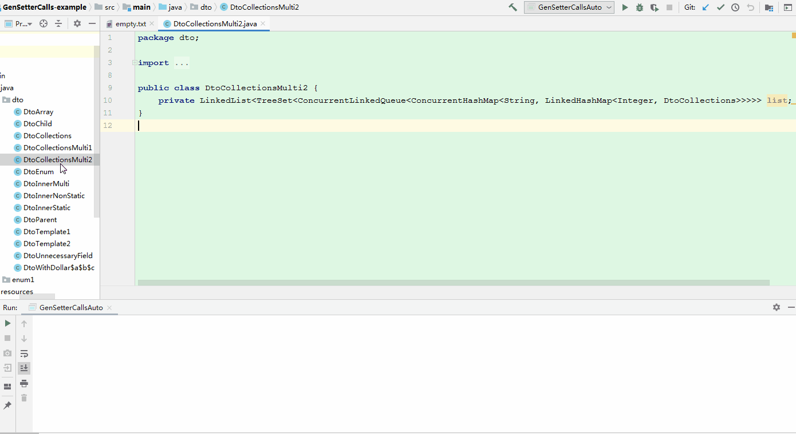
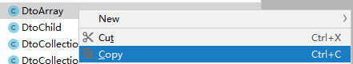
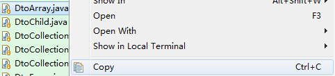
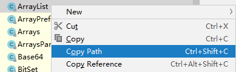
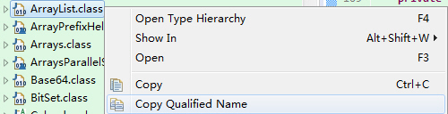

[](https://search.maven.org/artifact/com.github.adrninistrator/GenSetterCalls/)

[](https://github.com/Adrninistrator/GenSetterCalls/blob/master/LICENSE)


# 1. 演示



如上图所示，可以快速自动生成Java dto的set方法调用。

使用时只需要两步：复制、执行，之后就可以粘贴生成好的set方法调用代码（包括import、new语句等）。

# 2. 代码地址

- 生成set方法调用代码的工程

https://github.com/Adrninistrator/GenSetterCalls 、 https://gitee.com/adrninistrator/GenSetterCalls 。

- 示例工程

https://github.com/Adrninistrator/GenSetterCalls-example 、 https://gitee.com/adrninistrator/GenSetterCalls-example 。

# 3. 实现功能

## 3.1. 生成set方法调用

当Java dto中的字段较多时，逐个手工编写字段的set方法的调用代码是比较繁琐的，有可能会出现遗漏或重复。

以下提供一种方法，能够快速自动生成Java dto的set方法调用。

针对以下类，会生成其字段的set方法调用：

- 指定的类及所有超类

例如C类继承自B类，B类继承自A类，在指定生成C类的set方法调用时，也会生成B类与A类的set方法调用。

- 指定的类及所有超类引用的自定义类型

以上所述自定义类型指非基本类型，非数组类型，非枚举类型，非以下包中的类"java.", "javax.", "javafx.", "com.sun", "sun."，非nonCustomPackage参数指定包中的类（后续说明）。

例如A类或其超类中引用了B类，在指定生成A类的set方法调用时，也会生成B类的set方法调用。

- 指定的类及所有超类的集合、数组引用的自定义类型

例如A类或其超类中通过集合或数组引用了B类（如Map\<String, B\>，List\<B\>，Set\<B\>，Queue\<B\>，B[]等），在指定生成A类的set方法调用时，也会生成B类的set方法调用。

支持集合嵌套或多维数组中的自定义类型，如List\<String, Map\<String,B\>\>，B[][]等。

- 被引用的自定义类型中引用的其他自定义类型

例如A类或其超类中引用了B类，B类中引用了C类，在指定生成A类的set方法调用时，也会生成B类与C类的set方法调用。

针对以下字段，会生成其set方法调用：

- 满足非public，非static，非final条件。

在生成set方法时，会显示对应的字段类型，便于使用，示例如下。该功能可关闭，后续说明。

```java
dtoCollections.setList1(List<String>);
dtoCollections.setMap1(Map<DtoParent, String>);

dtoParent.setA_b(String);
dtoParent.setA_c(int);

dtoChild.setB(Boolean);
```

## 3.2. 生成import语句

对于生成了set方法调用代码的类，也会生成其对应的import语句。该功能可关闭，后续说明。

## 3.3. 生成new语句

对于生成了set方法调用代码的类，也会生成其对应的new语句。支持内部类（静态与非静态）。

# 4. 支持版本

支持JDK 1.6及以上版本。

在Windows 7 x64 SP1操作系统，使用IntelliJ IDEA 2019.2.4 (Community Edition)、Eclipse IDE for Enterprise Java Developers 2019-06 (4.12.0)进行验证（以下默认使用Windows操作系统）。

在macOS 10.14.4操作系统，使用Android Studio 3.5进行验证。

# 5. 使用方法

## 5.1. 添加依赖jar包

在Java工程中，添加以下依赖Jar包，建议在工程的测试模块添加。可以参考“GenSetterCalls-example”项目。

依赖Jar包的信息如下：

| 属性名 | 属性值 |
| ------------ | ------------ |
| groupId | com.github.adrninistrator |
| artifactId | GenSetterCalls |
| version | 0.0.1 |

- 使用Maven

```xml
<dependency>
    <groupId>com.github.adrninistrator</groupId>
    <artifactId>GenSetterCalls</artifactId>
    <version>0.0.1</version>
    <scope>test</scope>
</dependency>
```

- 使用Gradle

```gradle
"com.github.adrninistrator:GenSetterCalls:0.0.1"
```

- 不使用构建工具

maven中央仓库下载地址如下：

https://search.maven.org/artifact/com.github.adrninistrator/GenSetterCalls/ 、 https://repo1.maven.org/maven2/com/github/adrninistrator/GenSetterCalls/ 。

可下载Jar包后在IDE中手工添加依赖，步骤略。

## 5.2. 使用步骤

使用步骤主要为两步：

- 复制需要生成set方法调用代码的Java类信息；
- 执行生成set方法调用代码的类。

### 5.2.1. 复制Java类信息

#### 5.2.1.1. 复制Java类信息推荐方法

在复制需要生成set方法调用代码的Java类信息时，推荐使用以下方法。

##### 5.2.1.1.1. 工程中的Java文件

对于工程中的Java文件，可使用IDE或操作系统复制文件的功能（复制后可在操作系统资源管理器中粘贴对应的文件）。

- 在IDEA操作

在IDEA的“Project”窗口中，找到对应的Java文件，点击“Copy”菜单（快捷键：Ctrl + C）。



- 在Eclipse操作

在Eclipse的“Project Explorer”窗口中，找到对应的Java文件，点击“Copy”菜单（快捷键：Ctrl + C）。



- 在macOS中使用Android Studio操作

在macOS中使用Android Studio操作时，在Android Studio中复制文件后无法在操作系统资源管理器粘贴文件，在执行生成set方法调用代码的类时，也无法从剪切板中获取到Java文件信息，需要使用其他方式复制。

##### 5.2.1.1.2. Jar包中的Java类

- 在IDEA操作

对class文件，点击“Copy Path”菜单（快捷键：Ctrl + Shift + C）。



- 在Eclipse操作
  
对class文件，点击“Copy Qualified Name”菜单。



#### 5.2.1.2. 复制Java类信息支持的格式

在复制需要生成set方法调用代码的Java类信息时，支持以下格式，可以根据实际情况选择。

##### 5.2.1.2.1. 复制工程中的Java文件

|  |  |
| ------------ | ------------ |
| 在操作系统资源管理器操作 | 对Java文件，进行复制操作 |
| 在IDEA操作 | 对Java文件，点击“Copy”菜单（快捷键：Ctrl + C） |
| 在Eclipse操作 | 对Java文件，点击“Copy”菜单（快捷键：Ctrl + C） |
| 复制的数据 | 复制的数据为文件本身 |
| 支持类型 | 只支持工程中的Java文件 |

##### 5.2.1.2.2. 复制工程中的Java文件完整路径

|  |  |
| ------------ | ------------ |
| 在IDEA操作 | 对Java文件，点击“Copy Path”菜单（快捷键Ctrl + Shift + C） |
| 在Eclipse操作 | 对Java文件，点击“Properties”（快捷键：Alt + Enter），复制弹出窗口的“Location”属性 |
| 复制的数据格式示例 | E:\code\GenSetterCalls-example\src\main\java\dto\DtoArray.java |
| 支持类型 | 只支持工程中的Java文件 |

##### 5.2.1.2.3. 复制Java类名/Jar包中类名完整路径

|  |  |
| ------------ | ------------ |
| 在IDEA操作 | 对Java文件，点击“Copy Reference”菜单（快捷键Ctrl + Alt + Shift + C） / 对Jar包中的class文件，点击“Copy Path”菜单（快捷键Ctrl + Shift + C） |
| 复制的数据格式示例 | dto.DtoArray / C:\program\Java\jdk1.8.0_144\jre\lib\rt.jar!\java\util\ArrayList.class |
| 支持类型 | 支持工程中的Java文件、Jar包中的Java类 |

##### 5.2.1.2.4. 复制Java类名.class

|  |  |
| ------------ | ------------ |
| 在Eclipse操作 | 对Jar包中的class文件，点击“Copy Qualified Name”菜单 |
| 复制的数据格式示例 | java.util.ArrayList.class |
| 支持类型 | 只支持Jar包中的Java类 |

##### 5.2.1.2.5. 复制工程中的Java文件对应class文件完整路径

|  |  |
| ------------ | ------------ |
| 复制的数据格式示例 | E:\code\GenSetterCalls-example\out\production\classes\dto\DtoArray.class |
| 支持类型 | 只支持工程中的Java文件 |

### 5.2.2. 执行生成set方法调用代码的类

执行以下类，完成后生成的代码会复制到剪切板，同时也会在标准输出显示。

```
com.github.adrninistrator.gensettercalls.gen.GenSetterCallsAuto
```

- 在IDEA操作 

在IDEA中执行上述类时，当使用Gradle时，“Use classPath of module”建议选择工程的测试模块。

- 在Eclipse操作

在Eclipse中执行上述类时，可直接执行。

当使用Eclipse导入使用Maven的Java工程时，当上述依赖Jar包的“scope”设置为“test”时，可能会导致执行GenSetterCallsAuto类时提示找不到类，需要将“\<scope\>test\</scope\>”注释或删除。

## 5.3. 批量生成set方法调用代码

可以执行GenSetterCalls类的handleClasses()方法，支持批量生成指定类的set方法调用代码，传入参数可为Class数组，或完整类名数组。

在执行完成后，会在标准输出显示生成的代码，不会复制到剪切板。

可参考“GenSetterCalls-example”项目，TestClassArray、TestClassNameArray类。

# 6. 参数说明

在执行GenSetterCallsAuto或GenSetterCalls类时，支持指定以下JVM参数，示例如下：

```
-Ddebug=1 -Dsort=1 -DhideType=1 -DhideImport=1 -DnonCustomPackage=dto.,dto1.
```

- debug

当未指定该参数或为空值时，不会输出调试信息（默认情况）；
当该参数为非空值时，会输出调试信息。

- sort

当未指定该参数或为空值时，生成set方法时使用变量声明的顺序（默认情况）；
当该参数为非空值时，生成set方法调用代码时按照变量名称进行正向排序。

- hideType

当未指定该参数或为空值时，在生成set方法调用代码时会同时生成参数类型，例如“testC.setList1(List\<String\>);”（默认情况）；
当该参数为非空值时，在生成set方法调用代码时不会生成参数类型，例如“testC.setList1();”。

- hideImport

当未指定该参数或为空值时，会生成对应类的import语句（默认情况）；
当该参数为非空值时，不会生成对应类的import语句。

- nonCustomPackage

当未指定该参数或为空值时，仅对于"java.", "javax.", "javafx.", "com.sun", "sun."包中的类不会生成set方法调用代码（默认情况）；
当该参数为非空值时，对于上述的包，及该参数指定的包中的类（也可指定类名），不会生成set方法调用代码，该参数使用半角逗号“,”分隔。

# 7. 使用说明

- 指定的类需要先完成编译

对于指定的需要生成set方法调用的Java文件，需要完成编译后，才能使用以上方法生成set方法调用，否则会提示找不到对应的类。

- 复制多个文件

当复制多个文件后，在执行GenSetterCallsAuto类时，只会处理第一个文件。

- 从IDEA拷贝后出现异常

当从IDEA中拷贝代码后再执行GenSetterCallsAuto类时，会出现异常提示，不会影响正常使用，异常信息如下所示：

```
Exception "java.lang.ClassNotFoundException: com/intellij/codeInsight/editorActions/FoldingData"while constructing DataFlavor for: application/x-java-jvm-local-objectref; class=com.intellij.codeInsight.editorActions.FoldingData
```

- 不支持多于一层的内部类

当指定的需要生成set方法调用代码的Java类的内部类多于一层时，会提示“不支持多于一层的内部类”，生成的对应内部类的new语句仅包含类名简称。

例如对“GenSetterCalls-example”项目中的DtoInnerMulti类生成set方法调用时，会提示“不支持多于一层的内部类: dto.DtoInnerMulti$TestInnerM1$TestInnerM2”，TestInnerM2类对应的new语句为“TestInnerM2 testInnerM2 = new TestInnerM2();”。

# 8. 与IDEA插件generateAllSetter对比

使用IDEA插件generateAllSetter也可以生成set方法调用代码，但有以下限制（2.4版本）：

- dto需要有set方法，如果用了Lombok，dto中的字段无set方法时，generateAllSetter插件无法生成set方法调用代码；
  
- generateAllSetter插件在生成set方法调用代码时，只能生成当前类及超类中的字段的set方法，对于引用的自定义类型，及集合、数组、引用的自定义类型中引用的自定义类型无法生成；
  
- 需要先手写对应对象的new语句；
  
- 只能在IDEA中使用。

上述功能不存在以上限制。

# 9. 扩展

以“GenSetterCalls”项目代码为基础，可以根据Java dto生成对应的接口文档，例如使用自定义注解指定接口与字段描述等信息；在此基础上，还可为生成的set方法代码自动添加注释。